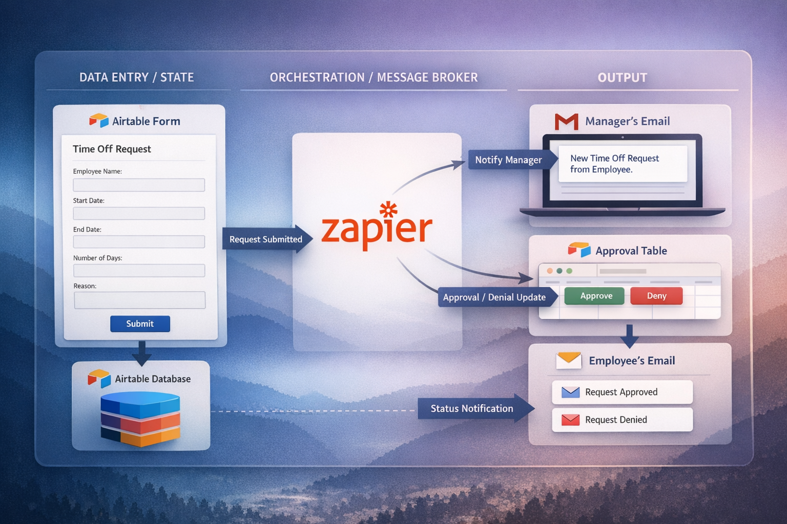

# 🏢 Automated Event-Driven PTO Management Pipeline

## 📌 Overview
This project is an automated, event-driven Paid Time Off (PTO) management system. It acts as a lightweight ETL pipeline that extracts form submission data, transforms it via database rollups and conditional logic, and loads notifications to end-users via automated webhooks. 

The goal of this architecture is to streamline the submission, approval, and tracking of leave requests while maintaining strict referential integrity between employee records and transaction logs.

🔗 **[Watch the End-to-End Demo Video Here](assets/Automated PTO.mp4)**

---

## 🏗 System Architecture 

This system leverages a relational database model for state management and an event-driven architecture for orchestration:
* **Database & Logic:** Airtable (Acting as the primary data store and transformation engine).
* **Orchestration & Routing:** Zapier (Acting as the message broker listening for state changes).
* **Communication:** Gmail Integration.

---

## 🗄️ Database Schema & Transformations
To maintain proper database normalization, the architecture is split into two primary tables linked via foreign keys (`Employee Record ID`).

### 1. Employees Table (Dimension Table)
Acts as the primary master directory and handles aggregate balance calculations.
* **Primary Key:** `Employee Record` (Formula combining ID + Name)
* **Master Data Fields:** Email, Manager Email, Total Annual PTO (Default: 22).
* **Transformations & Logic:** * Utilizes a `Rollup` function (`SUM` filtering strictly by "Approved" status) to aggregate taken days dynamically from the transaction logs. 
  * A formula dynamically calculates `Remaining PTO` in real-time.

### 2. Leave Requests Table (Transaction Table)
Captures individual state changes, incoming payloads, and idempotency timestamps.
* **Primary Key:** `Request ID` (Autonumber)
* **Key Fields:** Start/End Dates, Status (`Pending`, `Approved`, `Rejected`).
* **Transformations & Logic:** * Utilizes the `WORKDAY_DIFF` algorithm to automatically calculate requested working days, omitting weekends. 
  * Lookup fields pull Manager and Employee contact data into the payload for webhook routing.

---

## ⚡ Automation Workflows
The system uses automated listeners to trigger downstream communications based on specific database events.

* **Workflow A: Manager Notification (New Payload)**
  * **Trigger:** `POST` event when a new record is created in the `Leave Requests` table.
  * **Action:** Parses the record payload and routes a formatted email to the `Manager Email` variable containing the request details.
* **Workflow B: Employee Resolution (State Change)**
  * **Trigger:** Record enters the "Processed Requests" view (filtered by `Status != Pending`). A `Last Modified` timestamp constraint strictly monitoring the `Status` column ensures idempotency, preventing duplicate webhook triggers.
  * **Action:** Routes an email to the `Employee Email` variable containing the final decision and notes.

---

## 🧠 Key Technical Challenges Overcome

* **Master Data Management & Lookup Visibility:** Addressed issues where downstream orchestration failed due to missing foreign key data. Enforced strict master data population in the dimension table to ensure seamless variable mapping in Zapier.
* **Idempotency & State Tracking:** Prevented duplicate notification loops during the approval phase by implementing targeted `Last Modified` timestamp constraints, ensuring webhooks only fired on explicit status changes rather than general row updates.
* **Batch Polling vs. Real-Time Streaming:** Navigated the constraints of Zapier's 15-minute polling intervals by engineering the database views to hold data securely until the next batch processing cycle triggered the downstream webhooks.

---

## 🚀 Next Steps for Scale (Future Migration)
While this prototype utilizes Airtable and Zapier for rapid deployment, the architecture is designed to scale into a traditional tech stack:

* **Relational Migration:** Transitioning the Airtable dimension and transaction tables into a robust SQL database (e.g., PostgreSQL).
* **Orchestration & Automation:** Replacing Zapier webhooks with custom Python scripts, orchestrated by a tool like Apache Airflow or standard Linux cron jobs.
* **Analytics Integration:** Because the data is structured cleanly into dimension and transaction tables, it is perfectly primed to connect to a visualization tool (like Power BI or Tableau) to build real-time HR dashboards tracking leave velocity and departmental absence trends.
